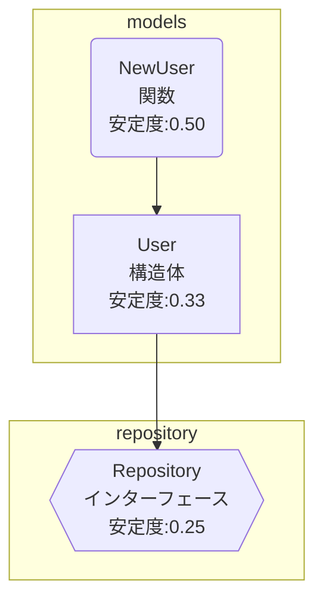

# Depsee

[](https://goreportcard.com/report/github.com/harakeishi/depsee)
[](https://godoc.org/github.com/harakeishi/depsee)
[](https://opensource.org/licenses/MIT)

[English](README.md) | [日本語](README.ja.md)

Depseeは、Goコードの依存関係を可視化するためのCLIツールです。構造体、インターフェース、関数間の依存関係を解析し、Mermaid記法を使用して視覚的に表現します。

## 特徴

- 🎯 構造体、インターフェース、関数の依存関係を自動解析
- 📊 Mermaid記法による視覚的な依存関係図の生成
- 📦 パッケージごとのグループ化表示
- 📈 安定度（Instability）の計算と表示
- 🔄 同一リポジトリ内の依存関係の再帰的解析（オプション）

## インストール

```bash
# Go 1.16以上が必要です
go install github.com/harakeishi/depsee@latest
```

## クイックスタート

```bash
# 基本的な使用方法
depsee analyze ./internal

# 同一リポジトリ内の依存関係も再帰的に解析
depsee analyze --with-local-imports ./internal
```

## 使用方法

### コマンドラインオプション

```bash
depsee analyze [オプション] <target_dir>
```

| オプション | 説明 |
|------------|------|
| `--with-local-imports` | 同一リポジトリ内のimport先パッケージも再帰的に解析 |
| `--version` | バージョン情報を表示 |

### 出力例

```
[info] 解析対象ディレクトリ: ./internal
[info] 構造体一覧:
  - User (package: models, file: user.go)
      * メソッド: GetName
[info] インターフェース一覧:
  - Repository (package: repository, file: repository.go)
[info] 関数一覧:
  - NewUser (package: models, file: user.go)
```

### Mermaid記法による依存関係図



## 開発

### 必要条件

- Go 1.16以上
- [Mermaid](https://mermaid-js.github.io/mermaid/)（依存関係図の表示用）

### ビルド

```bash
# リポジトリのクローン
git clone https://github.com/harakeishi/depsee.git
cd depsee

# ビルド
go build -o depsee cmd/depsee/main.go
```

### テスト

```bash
go test ./...
```

## プロジェクト構造

```
.
├── cmd/
│   └── depsee/        # CLIエントリポイント
├── internal/
│   ├── analyzer/      # 静的解析ロジック
│   ├── graph/         # 依存グラフ・安定度算出
│   └── output/        # Mermaid出力
└── testdata/          # サンプルGoコード・テスト用
```

## 貢献

1. このリポジトリをフォーク
2. 新しいブランチを作成 (`git checkout -b feature/amazing-feature`)
3. 変更をコミット (`git commit -m 'Add some amazing feature'`)
4. ブランチにプッシュ (`git push origin feature/amazing-feature`)
5. プルリクエストを作成

## ライセンス

このプロジェクトはMITライセンスの下で公開されています。詳細は[LICENSE](LICENSE)ファイルを参照してください。 