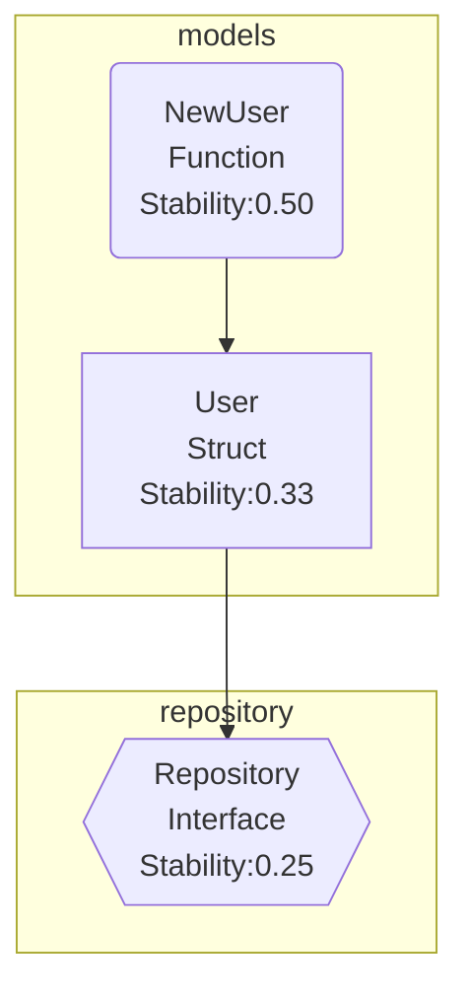

# Depsee

[](https://goreportcard.com/report/github.com/harakeishi/depsee)
[](https://godoc.org/github.com/harakeishi/depsee)
[](https://opensource.org/licenses/MIT)

[English](README.md) | [日本語](README.ja.md)

Depsee is a CLI tool for visualizing dependencies in Go code. It analyzes dependencies between structs, interfaces, and functions, and represents them visually using Mermaid notation.

## Features

- 🎯 Automatic analysis of dependencies between structs, interfaces, and functions
- 📊 Visual dependency diagram generation using Mermaid notation
- 📦 Package-based grouping display
- 📈 Stability (Instability) calculation and display
- 🔄 Recursive analysis of dependencies within the same repository (optional)

## Installation

```bash
# Requires Go 1.16 or later
go install github.com/harakeishi/depsee@latest
```

## Quick Start

```bash
# Basic usage
depsee analyze ./internal

# Analyze dependencies recursively within the same repository
depsee analyze --with-local-imports ./internal
```

## Usage

### Command Line Options

```bash
depsee analyze [options] <target_dir>
```

| Option | Description |
|--------|-------------|
| `--with-local-imports` | Recursively analyze imported packages within the same repository |
| `--version` | Display version information |

### Example Output

```
[info] Target directory: ./internal
[info] Structs:
  - User (package: models, file: user.go)
      * Method: GetName
[info] Interfaces:
  - Repository (package: repository, file: repository.go)
[info] Functions:
  - NewUser (package: models, file: user.go)
```

### Dependency Diagram in Mermaid Notation



## Development

### Prerequisites

- Go 1.16 or later
- [Mermaid](https://mermaid-js.github.io/mermaid/) (for dependency diagram display)

### Build

```bash
# Clone the repository
git clone https://github.com/harakeishi/depsee.git
cd depsee

# Build
go build -o depsee cmd/depsee/main.go
```

### Testing

```bash
go test ./...
```

## Project Structure

```
.
├── cmd/
│   └── depsee/        # CLI entry point
├── internal/
│   ├── analyzer/      # Static analysis logic
│   ├── graph/         # Dependency graph and stability calculation
│   └── output/        # Mermaid output
└── testdata/          # Sample Go code and test data
```

## Contributing

1. Fork this repository
2. Create your feature branch (`git checkout -b feature/amazing-feature`)
3. Commit your changes (`git commit -m 'Add some amazing feature'`)
4. Push to the branch (`git push origin feature/amazing-feature`)
5. Open a Pull Request

## License

This project is licensed under the MIT License - see the [LICENSE](LICENSE) file for details.