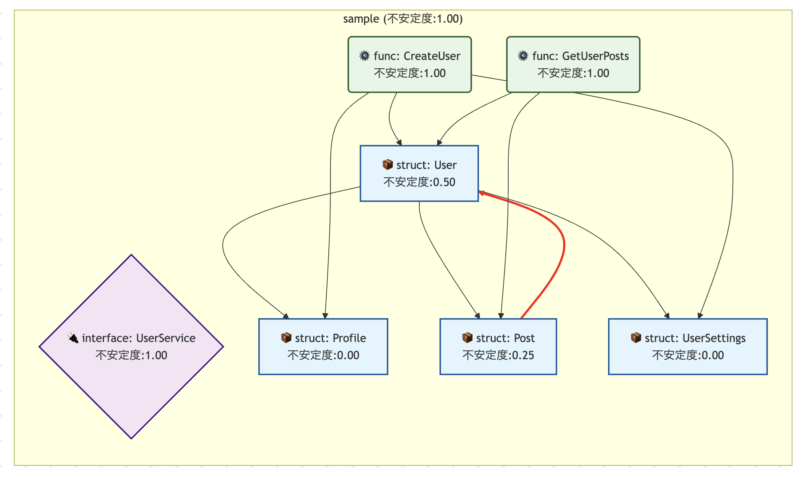

# depsee

[](https://github.com/harakeishi/Depsee/actions/workflows/ci.yml)
[](https://github.com/harakeishi/Depsee/actions/workflows/auto-release.yml)
[](https://goreportcard.com/report/github.com/harakeishi/depsee)
[](https://codecov.io/gh/harakeishi/Depsee)
[](https://github.com/harakeishi/Depsee/releases/latest)
[](https://github.com/harakeishi/Depsee/pkgs/container/depsee)

**English | [日本語](README.ja.md)**

A CLI tool that visualizes dependencies between structs, functions, and interfaces in Go code and outputs instability metrics (ease of change) in Mermaid notation.

## Features

- 🔍 **Static Analysis**: Analyzes Go code to extract structs, functions, and interfaces
- 📊 **Dependency Visualization**: Represents dependencies between elements in graph structure
- 📦 **Inter-package Dependencies**: Analyzes dependencies between packages within the same repository (optional)
- 🎯 **Package Filtering**: Functionality to analyze only specified packages
- 🚫 **Exclusion Features**: Functionality to exclude specified packages or directories from analysis
- 📈 **Instability Calculation**: Calculates instability metrics based on SOLID principles
- 🎨 **Mermaid Output**: Generates correlation diagrams in Mermaid notation
- 🛠️ **High-Quality Design**: Extensible architecture adhering to SOLID principles

## Installation

### Go (Recommended)

```bash
go install github.com/harakeishi/depsee@latest
```

### Docker

```bash
# Use latest version
docker pull ghcr.io/harakeishi/depsee:latest

# Use specific version
docker pull ghcr.io/harakeishi/depsee:v1.0.0
```

### Binary Download

You can download binaries for your platform from [GitHub Releases](https://github.com/harakeishi/Depsee/releases/latest):

- **Linux**: `depsee_Linux_x86_64.tar.gz`
- **macOS (Intel)**: `depsee_Darwin_x86_64.tar.gz`
- **macOS (Apple Silicon)**: `depsee_Darwin_arm64.tar.gz`
- **Windows**: `depsee_Windows_x86_64.zip`

### Build from Source

```bash
git clone https://github.com/harakeishi/Depsee.git
cd Depsee
go build -o depsee .
```

## Usage

### Basic Usage Examples

```bash
# Analyze project
depsee analyze ./path/to/your/project

# Analysis including inter-package dependencies
depsee --include-package-deps analyze ./path/to/your/project

# Analyze only specific packages
depsee analyze --target-packages main ./path/to/your/project

# Analyze multiple packages
depsee analyze --target-packages main,cmd,pkg ./path/to/your/project

# Exclude specific packages
depsee analyze --exclude-packages test,mock ./path/to/your/project

# Exclude specific directories
depsee analyze --exclude-dirs testdata,vendor ./path/to/your/project

# Show version
depsee version

# Run with debug logging
depsee -log-level debug analyze ./path/to/project

# Run with JSON log format
depsee -log-format json analyze ./path/to/project

# Highlight SDP violations in red
depsee analyze --highlight-sdp-violations ./path/to/your/project
```

### Package Filtering

Using the `--target-packages` option, you can analyze only specified packages:

```bash
# Analyze only main package
depsee analyze --target-packages main ./your-project

# Analyze main and cmd packages only
depsee analyze --target-packages main,cmd ./your-project

# Analyze multiple packages (quote if containing spaces)
depsee analyze --target-packages "main, cmd, internal/service" ./your-project
```

This feature provides the following benefits:
- **Efficient analysis for large projects**: Focus on packages of interest
- **Incremental analysis**: Check dependencies incrementally by package
- **Performance improvement**: Reduce processing time by narrowing analysis scope

### Exclusion Features

Using `--exclude-packages` and `--exclude-dirs` options, you can exclude specified packages or directories from analysis:

```bash
# Exclude test packages
depsee analyze --exclude-packages test ./your-project

# Exclude multiple packages
depsee analyze --exclude-packages test,mock,vendor ./your-project

# Exclude testdata directory
depsee analyze --exclude-dirs testdata ./your-project

# Exclude multiple directories
depsee analyze --exclude-dirs testdata,vendor,third_party ./your-project

# Exclude both packages and directories
depsee analyze --exclude-packages test --exclude-dirs vendor ./your-project

# Combine filtering and exclusion
depsee analyze --target-packages main,cmd --exclude-packages test --exclude-dirs testdata ./your-project
```

This feature provides the following benefits:
- **Exclude unnecessary code**: Remove test code, vendor code, and other parts not needed for analysis
- **Efficient analysis**: Reduce processing time and focus on relevant parts through exclusion
- **Flexible configuration**: Exclusion settings available at both package and directory levels
- **Combinable**: Can be combined with target-packages for finer control

### SDP Violation Highlighting

Using the `--highlight-sdp-violations` option, you can highlight violations of the Stable Dependencies Principle (SDP) in red:

```bash
# Highlight SDP violations in the output diagram
depsee analyze --highlight-sdp-violations ./your-project

# Combine with other options
depsee analyze --target-packages main,cmd --highlight-sdp-violations ./your-project
```

This feature provides the following benefits:
- **Visual identification**: SDP violations are highlighted in red in the Mermaid diagram
- **SOLID principle compliance**: Helps identify where stable components depend on unstable ones
- **Code quality improvement**: Assists in refactoring to improve architectural stability

### Inter-package Dependency Analysis

Using the `--include-package-deps` option, you can also analyze dependencies between packages within the same repository:

```bash
# Analysis including inter-package dependencies
depsee --include-package-deps analyze ./multi-package-project

# Use with package filtering
depsee analyze --target-packages main,cmd --include-package-deps ./multi-package-project
```

This feature additionally analyzes:
- Package nodes (`package:package_name`)
- Dependencies between packages (based on import statements)
- Standard library is excluded, only packages within the same repository are targeted

### Output Example

```
[info] Struct list:
  - User (package: sample, file: testdata/sample/user.go)
      * Method: UpdateProfile
      * Method: AddPost
  - Profile (package: sample, file: testdata/sample/user.go)
  - Post (package: sample, file: testdata/sample/user.go)
  - UserSettings (package: sample, file: testdata/sample/user.go)

[info] Interface list:
  - UserService (package: sample, file: testdata/sample/user.go)

[info] Function list:
  - CreateUser (package: sample, file: testdata/sample/user.go)
  - GetUserPosts (package: sample, file: testdata/sample/user.go)

[info] Dependency graph nodes:
  - sample.User (User)
  - sample.Profile (Profile)
  - sample.Post (Post)
  - sample.UserSettings (UserSettings)
  - sample.UserService (UserService)
  - sample.CreateUser (CreateUser)
  - sample.GetUserPosts (GetUserPosts)

[info] Node instability:
  sample.User: dependencies=3, dependents=3, instability=0.50
  sample.Post: dependencies=1, dependents=2, instability=0.33
  sample.UserService: dependencies=0, dependents=0, instability=1.00
  sample.CreateUser: dependencies=1, dependents=0, instability=1.00

[info] Mermaid correlation diagram:
graph TD
    sample.UserService["UserService<br>Instability:1.00"]
    sample.CreateUser["CreateUser<br>Instability:1.00"]
    sample.GetUserPosts["GetUserPosts<br>Instability:1.00"]
    sample.User["User<br>Instability:0.50"]
    sample.Post["Post<br>Instability:0.33"]
    sample.Profile["Profile<br>Instability:0.00"]
    sample.UserSettings["UserSettings<br>Instability:0.00"]

    sample.User --> sample.Profile
    sample.User --> sample.Post
    sample.User --> sample.UserSettings
    sample.Post --> sample.User
    sample.CreateUser --> sample.User
    sample.GetUserPosts --> sample.User
    sample.GetUserPosts --> sample.Post
```

### Demo


### SDP Violation Detection

The tool can also detect violations of the Stable Dependencies Principle (SDP), where stable components depend on unstable ones:



## Directory Structure

```
depsee/
├── cmd/                  # CLI entry point
├── internal/
│   ├── analyzer/         # Static analysis logic
│   ├── errors/           # Error handling
│   ├── graph/            # Dependency graph & stability calculation
│   ├── logger/           # Logging functionality
│   ├── output/           # Mermaid output
│   └── utils/            # Utility functions
├── pkg/depsee/           # Public API
├── testdata/sample/      # Sample Go code for testing
└── docs/                 # Design documentation
```

## Development

### Build

```bash
go build -o depsee cmd/depsee/main.go
```

### Test

```bash
go test ./...
```

### Development Run

```bash
go run cmd/depsee/main.go analyze ./testdata/sample
```

## CI/CD & Deployment

This project adopts a fully automated CI/CD pipeline, automating everything from code quality management to automatic releases.

### 🔄 Continuous Integration (CI)

**Triggers**: Pushes to `main` and `develop` branches, and pull requests to `main` branch

**Execution Content**:
- **Multi-version Testing**: Verification with Go 1.21, 1.22, 1.23
- **Test Execution**: Tests with race condition detection
- **Coverage Measurement**: Automatic upload to Codecov
- **Multi-platform Build**: Binary generation for Linux, macOS, Windows

```yaml
# Defined in .github/workflows/ci.yml
- Linux (amd64)
- macOS (amd64, arm64)  
- Windows (amd64)
```

### 🚀 Automatic Release

**Trigger**: Pushes to `main` branch (excluding specific commit types)

**Automatic Versioning**:
- **Major version** (`v1.0.0 → v2.0.0`): Commits starting with `feat!:` or containing `BREAKING CHANGE`
- **Minor version** (`v1.0.0 → v1.1.0`): Commits starting with `feat:`
- **Patch version** (`v1.0.0 → v1.0.1`): Other commits (`fix:`, `refactor:`, etc.)

**Excluded Commits**:
- Commits starting with `chore:`
- Commits starting with `docs:`
- Commits starting with `ci:`
- Commits containing `[skip release]` or `[skip ci]`

**Automatically Executed Processes**:
1. Automatically calculate next version from latest tag
2. Automatically update version variable in `cmd/root.go`
3. Commit and push version update
4. Create and push new tag
5. Create release with Go Releaser

### 📦 Release Artifacts

**Binaries**:
- `depsee_Linux_x86_64.tar.gz`
- `depsee_Darwin_x86_64.tar.gz`
- `depsee_Darwin_arm64.tar.gz`
- `depsee_Windows_x86_64.zip`

**Container Images**:
- `ghcr.io/harakeishi/depsee:latest`
- `ghcr.io/harakeishi/depsee:v{version}`

**Package Managers**:
- **Go**: `go install github.com/harakeishi/depsee@latest`

**Others**:
- Checksum file (`checksums.txt`)
- Auto-generated release notes
- Automatic CHANGELOG updates

### 🐳 Docker Usage

```bash
# Run latest version
docker run --rm -v $(pwd):/workspace ghcr.io/harakeishi/depsee:latest analyze /workspace

# Run specific version
docker run --rm -v $(pwd):/workspace ghcr.io/harakeishi/depsee:v1.0.0 analyze /workspace
```

### 🔧 Manual Release

In addition to automatic releases, manual releases are also possible:

```bash
# Manually create tag and release
git tag v1.2.3
git push origin v1.2.3
```

### 📋 Release Examples

**Patch Release**:
```bash
git commit -m "fix: fix bug"
git push origin main
# → Automatically releases v1.0.0 → v1.0.1
```

**Minor Release**:
```
