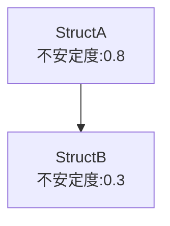

# コア機能設計：Mermaid記法での相関図生成

## 目的

- 依存グラフおよび安定度情報をもとに、Mermaid記法で相関図を生成し、可視化可能な形で出力する。

---

## 要件

- 依存グラフ（ノード・エッジ情報）および各ノードの不安定度情報を入力とする
- Mermaidの`graph TD`（Top Down）形式で出力
- ノード（構造体・インターフェース・関数）ごとに不安定度（Instability値）をラベルとして表示
- エッジは依存関係を表現
- 出力は標準出力またはファイル出力に対応
- ノード名の重複を避けるため、パッケージ名等で一意化
- ノード種別（構造体/インターフェース/関数）でラベルや色分けも拡張可能

---

## 入力

- 依存グラフ（DependencyGraph）
- 各ノードの不安定度情報（StabilityResult）

---

## 出力

- Mermaid記法による相関図テキスト

---

## 主な処理フロー

1. **ノードのMermaidラベル生成**
    - ノード名（例: `StructA`）＋不安定度（例: `不安定度:0.8`）をラベル化
    - 必要に応じてパッケージ名等で一意化

2. **エッジのMermaid記法生成**
    - 依存元→依存先のエッジを `A --> B` 形式で出力

3. **Mermaid全体構造の組み立て**
    - `graph TD` ヘッダ
    - ノードラベル定義
    - エッジ定義

4. **出力**
    - 標準出力またはファイル出力

---

## 想定出力例



---

## 想定データ構造（例：mermaid.go）

```go
func GenerateMermaid(graph *DependencyGraph, stability *StabilityResult) string
```

---

## 拡張ポイント

- ノード種別ごとに色分けやアイコン付与
- 依存関係の種類ごとにエッジのスタイル変更
- サブグラフ（パッケージ単位）対応
- ノード・エッジの詳細情報（ツールチップ等）付加 
