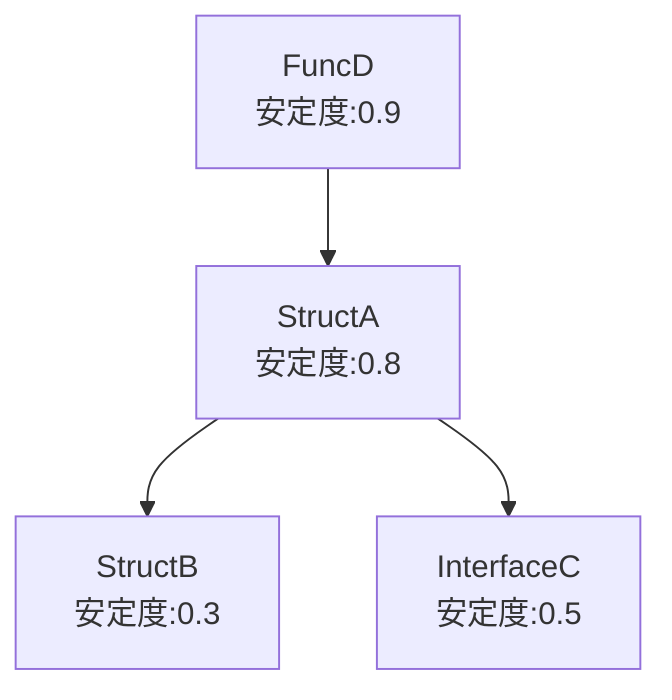

# Goコード相関・安定度可視化ツール 要件定義

## 概要

Go言語のコードベースを解析し、構造体・関数・インターフェース間の依存関係を相関図（Mermaid形式）で可視化するツール。  
各要素の依存数・非依存数を算出し、安定度（変更容易度）を相関図上に付加情報として表示する。

---

## 目的・背景

- Goプロジェクトの構造を俯瞰しやすくする
- 依存関係の多い/少ない箇所を可視化し、設計改善やリファクタリングの指針とする
- 安定度（変更容易度）を定量的に把握し、保守性向上に役立てる

---

## 想定ユーザー

- Go言語を用いた開発者
- プロジェクトの設計・リファクタリングを担当するエンジニア
- コードレビューやアーキテクチャ検討を行うチーム

---

## 主な機能

1. **Goコードの静的解析**
    - 指定ディレクトリ配下のGoコードを再帰的に解析
    - 構造体、関数、インターフェースの一覧取得

2. **依存関係の抽出**
    - 構造体、関数、インターフェース間の依存関係（利用・参照）を抽出

3. **依存数・非依存数の算出**
    - 各要素が依存している数（出次数）、依存されている数（入次数）を算出

4. **安定度（変更容易度）の算出**
    - 依存数・非依存数から安定度指標（例：I = 非依存数 / (依存数 + 非依存数)）を計算

5. **相関図（Mermaid形式）の生成**
    - 構造体・関数・インターフェース間の依存関係をMermaid記法で出力
    - 各要素に安定度指標を付加

---

## 入力・出力

- **入力**:  
  - パッケージ名 または Goコードのディレクトリパス

- **出力**:  
  - Mermaid記法による相関図（標準出力 or ファイル出力）

---

## パラメータ・設定

- 現状、特別なパラメータや設定は不要
- 将来的に除外パスや出力形式の拡張を検討

---

## その他

- 依存関係の可視化に特化し、複雑なUIやWeb表示は現時点で想定しない
- コード解析は標準Goパッケージ（go/parser, go/ast等）を活用

---

## 例

### 入力例

```sh
depsee analyze ./path/to/project
```

### 出力例（Mermaid記法）



--- 